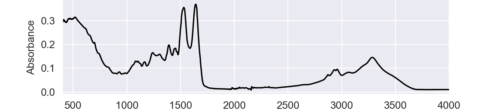
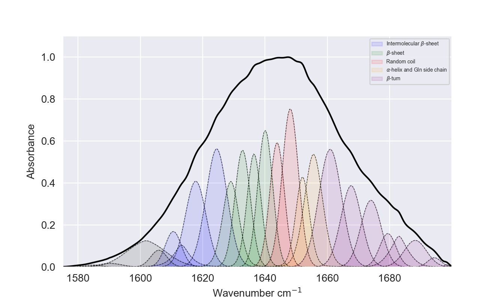

##  HbA1c level prediction using FTIR blood samples

This repository contains models for glycated haemoglobin content prediction using Fourier Transformed Infrared Spectroscopy (FTIR) of dried blood samples.

---
1) **Partial Least Squares Regression (PLSR)** is the most widely used regression model in chemometrics based on latent variable approach to modeling the covariance structures in X and Y spaces.
2) **Peak parameterization using curve fitting**. This approach includes finding of the "hidden peaks" using derivative spectroscopy and fitting a polynomial of the degree n, where n is the number of peaks found on the second or fourth derivative of the spectrum. From the resulting fit, information can be obtained about each peak's position, amplitude, width, and area. These values can be used to construct a new regression model with fewer parameters and better interpretability.
---

---
